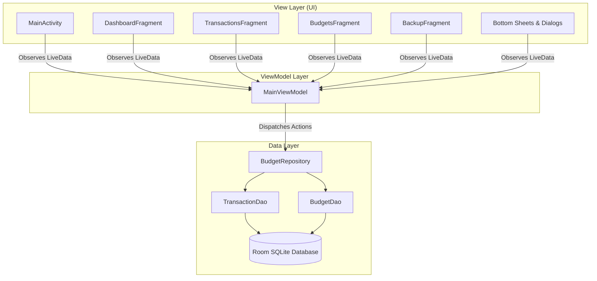

# Bongo Budget 💰

<p align="center">
  
</p>

<p align="center">
  <strong>A sleek, offline-first personal finance and category quota management app for Android.</strong>
</p>

<p align="center">
  
  
  
  
  
  
  
</p>

<p align="center">
  <a href="../../actions/workflows/release.yml">
    
  </a>
</p>

---

## 📖 Overview

**Bongo Budget** is a native Java Android application engineered to bring discipline, elegance, and complete clarity to personal finances. Built around the **Bangladeshi Taka (৳)** currency with an **AMOLED Pure Deep Black** aesthetic, Bongo Budget enforces budget integrity through an innovative **Shrinking Overall Budget Pool**, **Daily Spendable Quota calculations**, and **Strict Category Validation**.

All data is stored 100% locally on your device via Room SQLite—no servers, no ads, no trackers, and full offline freedom with instant JSON backup and restore capabilities.

---

## 🌟 Core Features & Highlights

### 🎯 1. Master Overall Budget & Shrinking Pool

- **Master Spending Pool**: Set your total monthly budget ceiling (e.g., `৳25,000`).
- **Live Shrinking Pool**: Allocating category quotas (e.g., Food, Transport, Groceries) automatically deducts from your available pool in real-time.
- **Overflow Protection**: The app strictly forbids setting category quotas that exceed the overall monthly budget.
- **Clean Separation**: `OVERALL` acts as the master funding pool and is never mixed into category selectors.

### ⏳ 2. Daily Spendable Budget Mode

- **Daily Spending Guidance**: Tap any budget card or quota to toggle between **Monthly Total** and **Daily Spendable** allowance.
- **Pace-Aware Calculations**: Intelligently computes how much you can spend per day based on remaining days in the active month and past expenditures.
- **One-Touch "Toggle All"**: Instantly switch every category quota between monthly view and daily spendable view simultaneously.

### 🏷️ 3. Strict Category Quotas & Custom Categories

- **No Unbudgeted Spending**: Expenses can only take place under established category quotas, completely preventing unaccounted financial leaks.
- **Created-Categories-Only Dropdown**: When logging expenses, the category dropdown strictly displays only the quotas you have created for the active month.
- **Custom Categories (`+ Custom Category...`)**: Create custom categories on the fly. The app automatically assigns fitting icons and theme colors based on smart keyword matching (e.g., `Gym`, `Gaming`, `Fitness`, `Books`, etc.).

### 🔍 4. Category Drill-Down & Transaction History

- **Tap to Inspect**: Tapping any category quota under Budgets or Dashboard opens a dedicated bottom sheet displaying all transactions recorded under that specific category for the active month.
- **Fast Expense Logging**: Log a new transaction for that specific category with one tap (`+ Add [Category]`).

### 🖤 5. AMOLED Pure Deep Black Theme

- **True Pitch Black (`#000000`)**: Optimized for OLED displays to drastically conserve battery life.
- **High-Contrast Typography**: Crisp white and slate text with vibrant Emerald Green (`৳` Income) and Ruby Red (`৳` Expense) status indicators.
- **Comfortable Night Reading**: Eliminates eye strain with soft divider lines and rounded card elevations.

### 💾 6. JSON Backup & Restore

- **Export Options**:
  - Save full JSON backup directly to storage via Android's Storage Access Framework (SAF).
  - One-tap ShareSheet to send backup via WhatsApp, Telegram, Google Drive, or Gmail.
  - Copy backup JSON directly to clipboard.
- **Import Options**:
  - **Merge**: Append new records while preserving existing transactions and budgets.
  - **Replace**: Clean wipe and restore exact state from backup.
  - Robust JSON schema validation and error protection.

### 🧪 7. Sample Data & One-Tap Reset

- **Explore in 1-Click**: Load a full set of realistic Bangladeshi income and expense transactions and category quotas with one tap.
- **Factory Reset**: Clear all app data safely with a double-confirmation dialog.

---

## 🏗️ Architecture & Design Pattern

Bongo Budget follows Google's recommended **MVVM (Model-View-ViewModel)** architectural pattern with Android Architecture Components:



- **Model**: Room SQLite Database (`AppDatabase`, `TransactionDao`, `BudgetDao`), Entities (`Transaction`, `Budget`), and POJOs (`CategorySpending`, `ExportData`).
- **Repository**: Single source of truth (`BudgetRepository`) handling asynchronous background operations via `ExecutorService`.
- **ViewModel**: `MainViewModel` orchestrates reactive UI state via `Transformations.switchMap`, date filtering, and live budget pool calculations.
- **View**: Fast, lightweight UI utilizing AndroidX `ViewBinding`, synchronous tag-based fragment switching, and Material 3 components.

---

## 📱 Navigation & User Interface

| Tab              | Icon | Description                                                                                                     |
| :--------------- | :--: | :-------------------------------------------------------------------------------------------------------------- |
| **Dashboard**    |  📊  | Real-time balance, monthly budget progress bar, spending by category breakdown, and recent transactions.        |
| **Transactions** |  💸  | Searchable transaction ledger with _All_, _Expense_, and _Income_ chips, plus quick edit/delete swipe menus.    |
| **Budgets**      |  🎯  | Overall budget pool manager, daily spendable toggles, category quota cards, and category transaction inspector. |
| **Backup**       |  💾  | Storage Access Framework export/import, clipboard tools, ShareSheet, and demo data generator.                   |

---

## 📦 JSON Backup Format

Backups are exported in standard, readable JSON:

```json
{
  "appName": "Bongo Budget",
  "version": 1,
  "exportDate": "2026-09-12T00:00:00Z",
  "budgets": [
    {
      "category": "OVERALL",
      "amount": 25000.0,
      "monthYear": "2026-09"
    },
    {
      "category": "Food & Dining",
      "amount": 6000.0,
      "monthYear": "2026-09"
    },
    {
      "category": "Groceries",
      "amount": 8000.0,
      "monthYear": "2026-09"
    }
  ],
  "transactions": [
    {
      "title": "Monthly Salary",
      "amount": 45000.0,
      "type": "INCOME",
      "category": "Salary",
      "date": 1789123200000,
      "note": "Office direct deposit"
    },
    {
      "title": "Bazaar Groceries",
      "amount": 1850.0,
      "type": "EXPENSE",
      "category": "Groceries",
      "date": 1789209600000,
      "note": "Fish and vegetables"
    }
  ]
}
```

---

## 🛠️ Tech Stack & Dependencies

| Component          | Library / Tool                      | Purpose                                   |
| :----------------- | :---------------------------------- | :---------------------------------------- |
| **Language**       | Java 11 / 17                        | Core Application Logic                    |
| **Architecture**   | Android Jetpack (MVVM)              | Lifecycle, ViewModel & LiveData           |
| **Local Database** | Room SQLite `2.6.1`                 | Offline Persistence & Queries             |
| **UI Components**  | Material Components 3 `1.12.0`      | Dark UI, BottomSheets, Cards              |
| **Layouts**        | ConstraintLayout & ViewBinding      | Type-safe, high-performance UI views      |
| **JSON Parser**    | Google Gson `2.10.1`                | Backup file serialization/deserialization |
| **Build System**   | Gradle 8.12 + Android Gradle Plugin | Dependency management & APK packaging     |
| **Testing**        | JUnit 4                             | Unit & calculation validation tests       |

---

## 📖 How to Use

New to Bongo Budget? Check out the [USAGE.md](USAGE.md) file for an in-depth walkthrough of all features, workflows, and tips.

---

## 🧰 Build from Source & Environment Info

For complete environment specifications, toolchain versions, and step-by-step IDE and terminal build guides, see [BUILD_INFO.md](BUILD_INFO.md).

### Prerequisites

- **Android Studio**: Ladybug / Iguana or later (or IntelliJ IDEA Community)
- **JDK**: OpenJDK 17 or 11
- **Android SDK**: Compile SDK 34, Min SDK 24, Target SDK 34

### 1. Clone the Repository

```bash
git clone https://github.com/rootminusone8004/bongo-budget.git
cd bongo-budget
```

### 2. Run Unit Tests

Execute the local unit test suite (budget allocation math, daily calculations, JSON import/export, and model checks):

```bash
./gradlew testDebugUnitTest
```

### 3. Build APK

- **Debug APK**:

  ```bash
  ./gradlew assembleDebug
  ```

  Generated at `app/build/outputs/apk/debug/app-debug.apk`.

- **Signed Release APK (Optimized & Shrunk)**:
  ```bash
  ./gradlew assembleRelease
  ```
  Generated at `app/build/outputs/apk/release/app-release.apk` (~2.0 MB).

---

## 🧪 Testing

Bongo Budget includes comprehensive unit test coverage:

- `BudgetAllocationCalculatorTest`: Verifies master pool deductions, quota limits, and overflow prevention.
- `DailyBudgetCalculatorTest`: Validates daily spendable pace across different calendar day counts and expenditure levels.
- `JsonExportImportTest`: Ensures two-way JSON backup serialization, deserialization, and field integrity.
- `ModelTest`: Verifies category resolution, keyword icon/color mapping, and OVERALL exclusion from categories.

Run all tests with:

```bash
./gradlew test
```

---

## 📝 Changelog

See [CHANGELOG.md](CHANGELOG.md) for details on all past releases, improvements, and bug fixes.

---

## 🤝 Contributing

Contributions, issues, and feature requests are welcome!

- 🐛 Report bugs or suggest enhancements via [GitHub Issues](https://github.com/rootminusone8004/bongo-budget/issues).
- 💡 Submit pull requests to propose new features or improvements.

---

## 🔒 Security

If you discover any security vulnerabilities or privacy concerns, please read our [SECURITY.md](SECURITY.md) for instructions on coordinated vulnerability disclosure.

---

## 📄 License

Bongo Budget - offline-first personal finance and category quota management app<br>
Copyright (C) 2024-present Md. Hashibur Rahman Kwoshik

This project is licensed under the **MIT License** - see the [LICENSE](LICENSE) file for details.
